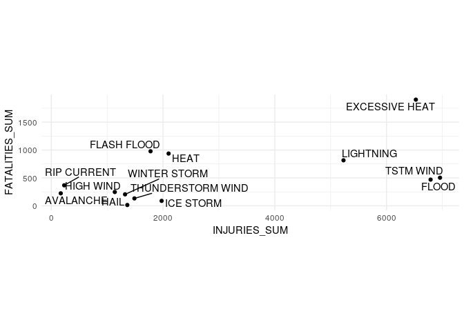

## Synopsis

## Data Processing

Load libraries and set code chunk defaults.


```r
library(readr)
library(R.utils)
library(dplyr)
library(tidyr)
library(ggplot2)
library(ggrepel)
knitr::opts_chunk$set(echo = TRUE)
```

First, retrieve the data set, if it does not exist.


```r
setwd("./")
fileUrl <- "https://d396qusza40orc.cloudfront.net/repdata%2Fdata%2FStormData.csv.bz2"
file <- file.path("data", "storm.csv.bz2")
data <- file.path("data", "storm.csv")

# Create data directory
if(!file.exists("data")) {
  dir.create("data")
}

# Retrieve data file
if(!file.exists(data)) {
  download.file(fileUrl, destfile = file, method = "curl")
  bunzip2(file, data)
  dateDownloaded <- date()
  dateDownloaded
}
```

Create a trimmed data file with the relevant columns for analysis, if it does not exist. Then, load the trimmed data set and display the first six rows.


```r
# load data
data_rds <- file.path("data", "trim.RDS")

if(!file.exists(data_rds)) {
  dat <- read_csv(data, col_types = cols(EVTYPE = col_factor(),
                                         CROPDMGEXP = col_character()))
  trim <- dat %>%
    select("EVTYPE", "FATALITIES", "INJURIES", "PROPDMG", "PROPDMGEXP",
           "CROPDMG", "CROPDMGEXP")
  write_rds(trim, data_rds)
}

df <- read_rds(data_rds)
head(df)
```

```
## # A tibble: 6 x 7
##   EVTYPE  FATALITIES INJURIES PROPDMG PROPDMGEXP CROPDMG CROPDMGEXP
##   <fct>        <dbl>    <dbl>   <dbl> <chr>        <dbl> <lgl>     
## 1 TORNADO          0       15    25   K                0 NA        
## 2 TORNADO          0        0     2.5 K                0 NA        
## 3 TORNADO          0        2    25   K                0 NA        
## 4 TORNADO          0        2     2.5 K                0 NA        
## 5 TORNADO          0        2     2.5 K                0 NA        
## 6 TORNADO          0        6     2.5 K                0 NA
```


```r
evtype <- df %>%
  group_by(EVTYPE) %>%
  summarize(FATALITIES_SUM = sum(FATALITIES),
            INJURIES_SUM = sum(INJURIES))

fatalities <- evtype %>%
  arrange(-FATALITIES_SUM, -INJURIES_SUM) %>%
  head(n = 11)

injuries <- evtype %>%
  arrange(-INJURIES_SUM, -FATALITIES_SUM) %>%
  head(n = 11)

tornado <- evtype %>%
  filter(EVTYPE != "TORNADO" &
         (FATALITIES_SUM > 0 | INJURIES_SUM > 0)) %>%
  arrange(-FATALITIES_SUM, -INJURIES_SUM)
```

## Results

```r
harm <- fatalities %>%
  bind_rows(injuries) %>%
  distinct(EVTYPE, .keep_all = TRUE) %>%
  filter(EVTYPE != "TORNADO") %>%
  arrange(-FATALITIES_SUM)

ggplot(harm, aes(INJURIES_SUM, FATALITIES_SUM)) +
  geom_point() +
  geom_text_repel(aes(label = EVTYPE)) +
  theme_minimal() +
  coord_fixed()
```

<!-- -->
