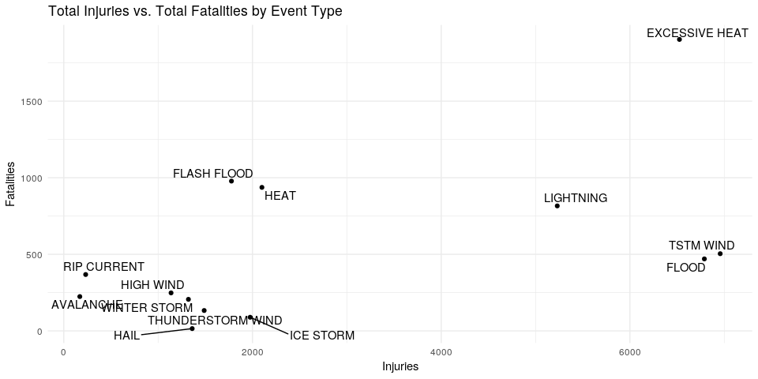
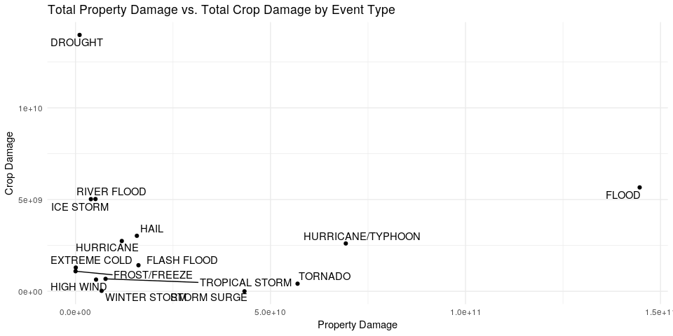

## Synopsis

This report analyzes the NOAA storm data set that includes data on severe weather events from the year 1950 and end in November 2011. The two questions analyzed are the following:

 1. Which weather events across the United States cause the most harm with respect to population health?
 2. Which weather events across the United States cause the greatest economic consequences?

Regarding harm to population health, the total resulting fatalities and total resulting injuries are aggregated for each event type. Regarding economic consequences, the total estimated damages to property and the total estimated damages to crop are aggregated for each event type.

The findings suggest that tornadoes are the most harmful event type overall and by a wide margin. For economic impact, floods and hurricanes result in the most damage overall. Droughts result in the largest damage to crops but not much property damage. Floods also result in the largest amount of property damage, by a wide margin.

## Data Processing

Load libraries and set code chunk defaults.


```r
library(readr)
library(R.utils)
library(dplyr)
library(tidyr)
library(ggplot2)
library(ggrepel)
knitr::opts_chunk$set(echo = TRUE)
```

First, retrieve the data set, if it does not exist.


```r
setwd("./")
fileUrl <- "https://d396qusza40orc.cloudfront.net/repdata%2Fdata%2FStormData.csv.bz2"
file <- file.path("data", "storm.csv.bz2")
data <- file.path("data", "storm.csv")

# Create data directory
if(!file.exists("data")) {
  dir.create("data")
}

# Retrieve data file
if(!file.exists(data)) {
  download.file(fileUrl, destfile = file, method = "curl")
  bunzip2(file, data)
  dateDownloaded <- date()
  dateDownloaded
}
```

To aid in quicker exploration and analysis, we create a trimmed data file with the relevant columns for analysis, if it does not exist. Then, we load the trimmed data set and display the first six rows.

To optimize the size of the trimmed data file, columns for property and crop damage estimate magnitudes, i.e. "PROPDMGEXP" and "CROPDMGEXP", are first cleaned and saved as factors, instead of character.


```r
# load data
data_rds <- file.path("data", "trim.RDS")

if(!file.exists(data_rds)) {
  dat <- read_csv(data, col_types = cols(EVTYPE = col_factor(),
                                         PROPDMGEXP = col_character(),
                                         CROPDMGEXP = col_character()))
  # keep relevant columns
  trim <- dat %>%
    select("EVTYPE", "FATALITIES", "INJURIES", "PROPDMG", "PROPDMGEXP",
           "CROPDMG", "CROPDMGEXP")

  #
  str(trim, give.attr = FALSE)
  summary(trim)
}
```

```
## Warning: 4971705 parsing failures.
##  row col           expected actual             file
## 1671 WFO 1/0/T/F/TRUE/FALSE     NG 'data/storm.csv'
## 1673 WFO 1/0/T/F/TRUE/FALSE     NG 'data/storm.csv'
## 1674 WFO 1/0/T/F/TRUE/FALSE     NG 'data/storm.csv'
## 1675 WFO 1/0/T/F/TRUE/FALSE     NG 'data/storm.csv'
## 1678 WFO 1/0/T/F/TRUE/FALSE     NG 'data/storm.csv'
## .... ... .................. ...... ................
## See problems(...) for more details.
```

```
## Classes 'spec_tbl_df', 'tbl_df', 'tbl' and 'data.frame':	902297 obs. of  7 variables:
##  $ EVTYPE    : Factor w/ 977 levels "TORNADO","TSTM WIND",..: 1 1 1 1 1 1 1 1 1 1 ...
##  $ FATALITIES: num  0 0 0 0 0 0 0 0 1 0 ...
##  $ INJURIES  : num  15 0 2 2 2 6 1 0 14 0 ...
##  $ PROPDMG   : num  25 2.5 25 2.5 2.5 2.5 2.5 2.5 25 25 ...
##  $ PROPDMGEXP: chr  "K" "K" "K" "K" ...
##  $ CROPDMG   : num  0 0 0 0 0 0 0 0 0 0 ...
##  $ CROPDMGEXP: chr  NA NA NA NA ...
```

```
##                EVTYPE         FATALITIES          INJURIES        
##  HAIL             :288661   Min.   :  0.0000   Min.   :   0.0000  
##  TSTM WIND        :219944   1st Qu.:  0.0000   1st Qu.:   0.0000  
##  THUNDERSTORM WIND: 82563   Median :  0.0000   Median :   0.0000  
##  TORNADO          : 60652   Mean   :  0.0168   Mean   :   0.1557  
##  FLASH FLOOD      : 54278   3rd Qu.:  0.0000   3rd Qu.:   0.0000  
##  FLOOD            : 25326   Max.   :583.0000   Max.   :1700.0000  
##  (Other)          :170873                                         
##     PROPDMG         PROPDMGEXP           CROPDMG         CROPDMGEXP       
##  Min.   :   0.00   Length:902297      Min.   :  0.000   Length:902297     
##  1st Qu.:   0.00   Class :character   1st Qu.:  0.000   Class :character  
##  Median :   0.00   Mode  :character   Median :  0.000   Mode  :character  
##  Mean   :  12.06                      Mean   :  1.527                     
##  3rd Qu.:   0.50                      3rd Qu.:  0.000                     
##  Max.   :5000.00                      Max.   :990.000                     
## 
```

Recode the damage estimate magnitude columns by looking at the set of possible recorded values for each.


```r
if(!file.exists(data_rds)) {
  message("Possible values for Property Damage Estimate Magnitude")
  print(unique(dat$PROPDMGEXP))
  message("Possible values for Crop Damage Estimate Magnitude")
  print(unique(dat$CROPDMGEXP))
}
```

```
## Possible values for Property Damage Estimate Magnitude
```

```
##  [1] "K" "M" NA  "B" "m" "+" "0" "5" "6" "?" "4" "2" "3" "h" "7" "H" "-"
## [18] "1" "8"
```

```
## Possible values for Crop Damage Estimate Magnitude
```

```
## [1] NA  "M" "K" "m" "B" "?" "0" "k" "2"
```

The documentation for the data set does not explain values, aside from "K", "M", and "B", which correspond to thousands, millions, and billions. These values are used to indicate the magnitude for the property and crop damage estimates columns. "H" appears to indicate hundreds, if the notation is followed.

All other values will be recoded to "1" to indicate "identity" or no magnitude modifier for the damage estimates. The estimate magnitude columns will then be save as factors.


```r
valid_mag <- c("H", "K", "M", "B")

if(!file.exists(data_rds)) {
  trim <- trim %>%
    mutate(PROPDMGEXP = toupper(PROPDMGEXP),
           CROPDMGEXP = toupper(CROPDMGEXP),
           PROPDMGEXP = ifelse(PROPDMGEXP %in% valid_mag, PROPDMGEXP, 1),
           CROPDMGEXP = ifelse(CROPDMGEXP %in% valid_mag, CROPDMGEXP, 1),
           PROPDMGEXP = as.factor(PROPDMGEXP),
           CROPDMGEXP = as.factor(CROPDMGEXP))
}
```

Next, the damage estimate columns are transformed to apply the magnitude modifier for each observation. The magnitude columns are no longer used, and thus are discarded. This transformation will prepare the damage estimates for statistical analysis.


```r
if(!file.exists(data_rds)) {
  trim <- trim %>%
    mutate(PROPDMGEXP = case_when(PROPDMGEXP == "H" ~ 100,
                                  PROPDMGEXP == "K" ~ 1000,
                                  PROPDMGEXP == "M" ~ 1000000,
                                  PROPDMGEXP == "B" ~ 1000000000,
                                  TRUE ~ 1),
           CROPDMGEXP = case_when(CROPDMGEXP == "K" ~ 1000,
                                  CROPDMGEXP == "M" ~ 1000000,
                                  CROPDMGEXP == "B" ~ 1000000000,
                                  TRUE ~ 1),
           PROPDMG = PROPDMG * PROPDMGEXP,
           CROPDMG = CROPDMG * CROPDMGEXP) %>%
    select(-PROPDMGEXP, -CROPDMGEXP)
}
```

Finally, the processed data is saved as an RDS file and loaded for analysis. The final data file size was reduced from a 536 MB uncompressed to a 31 MB RDS file.


```r
if(!file.exists(data_rds)) {
  write_rds(trim, data_rds)
}

df <- read_rds(data_rds)
str(df)
```

```
## Classes 'tbl_df', 'tbl' and 'data.frame':	902297 obs. of  5 variables:
##  $ EVTYPE    : Factor w/ 977 levels "TORNADO","TSTM WIND",..: 1 1 1 1 1 1 1 1 1 1 ...
##  $ FATALITIES: num  0 0 0 0 0 0 0 0 1 0 ...
##  $ INJURIES  : num  15 0 2 2 2 6 1 0 14 0 ...
##  $ PROPDMG   : num  25000 2500 25000 2500 2500 2500 2500 2500 25000 25000 ...
##  $ CROPDMG   : num  0 0 0 0 0 0 0 0 0 0 ...
```

## Results

### Most Harmful Weather Events

```
Across the United States, which types of events (as indicated in the EVTYPE
variable) are most harmful with respect to population health?
```

For the first question, the data will be grouped by event type and the fatalities and injuries for each group will be aggregated.


```r
evtype <- df %>%
  group_by(EVTYPE) %>%
  summarize(FATALITIES_SUM = sum(FATALITIES),
            INJURIES_SUM = sum(INJURIES))
```

Below are the top 11 event types for the most harmful event types. The first table ranks the event types by the total number of fatalities for an event type. The second table is similar to the first table but ranks by total number of injuries.


```r
fatalities <- evtype %>%
  arrange(-FATALITIES_SUM, -INJURIES_SUM) %>%
  head(n = 11)
kable(fatalities, caption = "Top 11 Events by Total Fatalities")
```


Table: Top 11 Events by Total Fatalities

EVTYPE            FATALITIES_SUM   INJURIES_SUM
---------------  ---------------  -------------
TORNADO                     5633          91346
EXCESSIVE HEAT              1903           6525
FLASH FLOOD                  978           1777
HEAT                         937           2100
LIGHTNING                    816           5230
TSTM WIND                    504           6957
FLOOD                        470           6789
RIP CURRENT                  368            232
HIGH WIND                    248           1137
AVALANCHE                    224            170
WINTER STORM                 206           1321


```r
injuries <- evtype %>%
  arrange(-INJURIES_SUM, -FATALITIES_SUM) %>%
  head(n = 11)
kable(injuries, caption = "Top 11 Events by Total Injuries")
```


Table: Top 11 Events by Total Injuries

EVTYPE               FATALITIES_SUM   INJURIES_SUM
------------------  ---------------  -------------
TORNADO                        5633          91346
TSTM WIND                       504           6957
FLOOD                           470           6789
EXCESSIVE HEAT                 1903           6525
LIGHTNING                       816           5230
HEAT                            937           2100
ICE STORM                        89           1975
FLASH FLOOD                     978           1777
THUNDERSTORM WIND               133           1488
HAIL                             15           1361
WINTER STORM                    206           1321

Tornadoes sits at the top of both lists and are by far the most harmful event type.

The two lists share many of the same events, although the order differs. Looking at the differences between the two lists help show the type of events that are cause more fatalities than injuries and vice versa.


```r
setdiff(fatalities$EVTYPE, injuries$EVTYPE)
```

```
## [1] "RIP CURRENT" "HIGH WIND"   "AVALANCHE"
```

For rip currents and avalanche, the number of fatalities exceeds its number of injuries, which suggests that death is more likely than injuries for these events. This relationship is not true for high winds, and its exclusion from the top injury-causing-events list may indicate that, while it causes a large share of fatalities, it's not as injurious as other events.


```r
setdiff(injuries$EVTYPE, fatalities$EVTYPE)
```

```
## [1] "ICE STORM"         "THUNDERSTORM WIND" "HAIL"
```

The three items that are on the top injury-causing-events list show several stormy events that result in fewer fatalities when compared to the level of injuries that result.

Finally, to get a better idea of where the events that result in the most fatalities and the ones that cause the most injuries sit in relation to each other, the plot below shows each event's total injuries vs. its total fatalities.

Tornado is excluded from the plot because the order of difference between it and other events makes the magnitude of non-tornado events difficult to discern. Tornadoes, to reiterate, result in the most total fatalities and total injuries, by a large margin.


```r
harm <- fatalities %>%
  bind_rows(injuries) %>%
  distinct(EVTYPE, .keep_all = TRUE) %>%
  filter(EVTYPE != "TORNADO") %>%
  arrange(-FATALITIES_SUM)

ggplot(harm, aes(INJURIES_SUM, FATALITIES_SUM)) +
  geom_point() +
  geom_text_repel(aes(label = EVTYPE)) +
  labs(title = "Total Injuries vs. Total Fatalities by Event Type",
       x = "Injuries",
       y = "Fatalities") +
  theme_minimal()
```

<!-- -->

### Most Economically Damaging Weather Events

```
Across the United States, which types of events have the greatest
economic consequences?
```

The analysis for greatest economic consequences is similar to the one done for most harmful to human population. See that section for additional details.

The analysis on economic impact will aggregate the total property damage and crop damage by event type.


```r
damage <- df %>%
  group_by(EVTYPE) %>%
  summarize(PROPDMG_SUM = sum(PROPDMG),
            CROPDMG_SUM = sum(CROPDMG))
summary(damage)
```

```
##                    EVTYPE     PROPDMG_SUM         CROPDMG_SUM       
##  TORNADO              :  1   Min.   :0.000e+00   Min.   :0.000e+00  
##  TSTM WIND            :  1   1st Qu.:0.000e+00   1st Qu.:0.000e+00  
##  HAIL                 :  1   Median :0.000e+00   Median :0.000e+00  
##  FREEZING RAIN        :  1   Mean   :4.374e+08   Mean   :5.026e+07  
##  SNOW                 :  1   3rd Qu.:5.400e+04   3rd Qu.:0.000e+00  
##  ICE STORM/FLASH FLOOD:  1   Max.   :1.447e+11   Max.   :1.397e+10  
##  (Other)              :971
```

Below are the lists ranking the top ten event types that cause the most property damage and the top ten event types that cause the most crop damage.


```r
prop_damage <- damage %>%
  arrange(-PROPDMG_SUM, -CROPDMG_SUM) %>%
  head(n = 10)
kable(prop_damage, caption = "Top 10 Events by Total Property Damage Estimates")
```


Table: Top 10 Events by Total Property Damage Estimates

EVTYPE                PROPDMG_SUM   CROPDMG_SUM
------------------  -------------  ------------
FLOOD                144657709807    5661968450
HURRICANE/TYPHOON     69305840000    2607872800
TORNADO               56937160779     414953270
STORM SURGE           43323536000          5000
FLASH FLOOD           16140862067    1421317100
HAIL                  15732267543    3025954473
HURRICANE             11868319010    2741910000
TROPICAL STORM         7703890550     678346000
WINTER STORM           6688497251      26944000
HIGH WIND              5270046295     638571300


```r
crop_damage <- damage %>%
  arrange(-CROPDMG_SUM, -PROPDMG_SUM) %>%
  head(n = 10)
kable(crop_damage, caption = "Top 10 Events by Total Crop Damage Estimates")
```


Table: Top 10 Events by Total Crop Damage Estimates

EVTYPE                PROPDMG_SUM   CROPDMG_SUM
------------------  -------------  ------------
DROUGHT                1046106000   13972566000
FLOOD                144657709807    5661968450
RIVER FLOOD            5118945500    5029459000
ICE STORM              3944927860    5022113500
HAIL                  15732267543    3025954473
HURRICANE             11868319010    2741910000
HURRICANE/TYPHOON     69305840000    2607872800
FLASH FLOOD           16140862067    1421317100
EXTREME COLD             67737400    1292973000
FROST/FREEZE              9480000    1094086000

The event types that appear to be the most economically devastating for both property and events are floods and hurricanes.

The plot below will give a better sense of the top event types along both property damage and crop damage dimensions.


```r
damage_merged <- prop_damage %>%
  bind_rows(crop_damage) %>%
  distinct(EVTYPE, .keep_all = TRUE) %>%
  arrange(-PROPDMG_SUM)

ggplot(damage_merged , aes(PROPDMG_SUM, CROPDMG_SUM)) +
  geom_point() +
  geom_text_repel(aes(label = EVTYPE)) +
  labs(title = "Total Property Damage vs. Total Crop Damage by Event Type",
       x = "Property Damage",
       y = "Crop Damage") +
  theme_minimal()
```

<!-- -->

By far, the most economically damaging event for crops are droughts, while the most economically damaging event for property is flood. As shown in the lists above, floods are also the second-most economically damaging events for crops.
